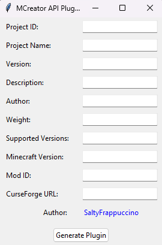

# MCreator API Plugin Generator 🛠️

[](https://www.python.org/)
[](https://github.com/SaltyFrappuccino/MCreator-API-Plugin-Generator/blob/main/LICENSE)
[](https://pyinstaller.org/)
[](https://www.curseforge.com/)

A professional tool for generating MCreator-compatible API plugins with CurseForge integration. Automates the creation of plugin archives containing properly structured JSON/YAML configurations and Gradle dependencies.

---

## Features ✨
- **GUI & CLI Support**: Generate plugins via user-friendly GUI or script
- **CurseForge URL Parsing**: Auto-extract mod name and file ID from URLs
- **Dynamic Archive Generation**: 
  - Creates `plugin.json` with metadata
  - Generates version-specific YAML configurations
  - Builds ZIP archives with correct directory structure
- **Validation**: Error handling for invalid inputs and URL formats
- **Custom Weighting**: Prioritize plugin loading order via weight system

---

## Project Structure 📂
| File                | Description                                                                 |
|---------------------|-----------------------------------------------------------------------------|
| `archive_generator.py` | Handles ZIP archive creation and file system operations                     |
| `gui.py`               | Tkinter-based GUI for user input and plugin generation                      |
| `main.py`              | CLI implementation example for batch processing                            |
| `project.py`           | Project class storing metadata and generating JSON/YAML content             |
| `utils.py`             | URL parsing utilities and validation functions                              |

---

## Installation & Usage 🚀

### Requirements
```bash
# Install dependencies from requimrenets.txt
pip install -r requimrenets.txt
```

### GUI Mode
```bash
python gui.py
```


### CLI Mode
```bash
python main.py
```

---

## GUI Field Reference 🖥️
| Field                 | Description                                                                 | Example                    |
|-----------------------|-----------------------------------------------------------------------------|----------------------------|
| **Project ID**        | Unique plugin identifier                                                    | `JujutsuCraft-Support`     |
| **Project Name**      | Display name for the plugin                                                 | `Jujutsu Craft Support`    |
| **Version**           | Plugin version (SemVer recommended)                                        | `2.0.0`                    |
| **Description**       | Brief plugin description                                                   | `Adds JujutsuCraft support`|
| **Author**            | Plugin creator name                                                        | `SaltyFrappuccino`         |
| **Weight**            | Loading priority (lower = earlier)                                         | `22`                       |
| **Supported Versions**| Comma-separated MCreator API versions                                       | `2024001,2024002`          |
| **Minecraft Version** | Target Minecraft version with loader                                       | `forge-1.20.1`             |
| **Mod ID**            | CurseForge project ID                                                      | `471288`                   |
| **CurseForge URL**    | Full URL to mod file page                                                  | `https://curseforge.com/...`|

---

## Technical Implementation 🔧
The generator creates archives containing:
```
📁 [mod_name].zip
├── 📄 plugin.json
└── 📁 apis
    └── 📄 [mod_name].yaml
```

### Key Components:
1. **plugin.json**
```json
{
  "id": "Jujutsu Craft (Sorcery Fight)",
  "weight": 22,
  "supportedversions": [2024001],
  "info": {
    "name": "Jujutsu Craft (Sorcery Fight)",
    "version": "2.0.0",
    "description": "JujutsuCraft Support",
    "author": "Satushi"
  }
}
```

2. **YAML File**
```yaml
---
forge-1.20.1:
  gradle: |
    repositories {
      maven {
          url = 'https://cursemaven.com/'
      }
    }
    dependencies {
      implementation fg.deobf('curse.maven:sorceryfight-471288:5358535')
    }
  update_files:
    - ~
name: "Jujutsu Craft (Sorcery Fight)"
```

---

## Dependencies 📦
| Package                | Version   | Purpose                          |
|------------------------|-----------|----------------------------------|
| `pyinstaller`          | 6.8.0     | Executable packaging             |
| `pefile`               | 2023.2.7  | Windows PE file analysis         |
| `pywin32-ctypes`       | 0.2.2     | Windows API integration          |

---

## Contributing 🤝
Pull requests welcome! For major changes, please open an issue first to discuss proposed changes.

---

## License 📜
[MIT](LICENSE) © [SaltyFrappuccino](https://github.com/SaltyFrappuccino)